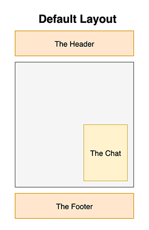

### Hypermedia Applications Course Project

#### Politecnico di Milano - a.y. 2020/2021

# Introduction

This repository contains the project work made by the authors listed in the end of this document for the Hypermedia Applications course held by prof. Franca Garzotto in Politecnico di Milano, academic year 2020/2021. The following sections are aimed at introducing the used terminology and a description of the used technologies.

## INVATION 🚀

Invation is an ICT company with a special eye on the Future. The name of the company is related to the union of Innovation and Invention, two words that already communicate the value proposition of our company. We propose "Visions": a collection of thematic guided tours across different innovative digital products. Developed as an interactive itinerary, each Vision is a set of Invations, bringing the user to explore new solution related to the theme chosen.

### Terminology

Developing the Company concept, we played with the name of the three most important entities required by the project.

| Original term | Invation Term   | description                                                                            |
| ------------- | --------------- | -------------------------------------------------------------------------------------- |
| Area          | **VISION**      | Interactive itinerary based on a chosen theme, created as a set of innovative products |
| Product       | **INVATION**    | Innovative inventions and ideas to shape a new concrete concept of future              |
| People        | **INVATIONERS** | Employees of the company                                                               |

# Technical Specification

## Overall architecture

The architecture above describes a classical **three tiers** architecture. In this section, this architecture is described in more detail

## Server and DB technologies used

With the aim of having our application accessible online, we developed a simple web server using **NodeJS with Express**, as recommended. In particular we created a server middleware represented by the _'api.js'_ file that acts as request handler. Our database instead, is implemented with the use of **PostgreSQL** with the help of **Sequelize** for ORM in NodeJS. **Axios** was used to handle the HTTP requests.

## Components development

The folder components is divided in the following subfolders:

- baseElements: it contains the base components that are used in several pages that don't own a semantic relationship
  - Breadcrump.vue: used to handle the different breadcrumps of each page
    - props:
      - pathsList: this prop is used to pass to this component the information needed to build the breadcrump, namely an Array of (path, pathName) where path is the path to the page inside the breadcrump that is associated to the pathName that is the String visible inside the breadcrump
      - breadcrumpClass: this prop has been created to let this component become customizable also from the point of view of the style so that each class can pass a different value to this toi make the breadcrump fit to the layout of the page
    - mounted(): this mounted is used to emit a custom event after the page in which the breadcrump is instantiated has been created to let the header catch this event and highlight the name of the navbar to which is associated the page itself.
  - ContentRoundedContainer.vue: a fancy container used to display the information on a certain content of the website like a vision or an invation or an invationer
    - props:
      - areaName: the name of the area by which this component is being used
      - description: the description of the area by which this component is being used
      - content: an Array in which each element contains all the information to render the content of a single RoundedContainer
      - descriptionName: needed to stress the reusability of this component, it allows to decouple the name of an attribute of a DB schema from its name used inside this component
      - imageName: needed to stress the reusability of this component, it allows to decouple the name of an attribute of a DB schema from its name used inside this component
      - typology: needed to understand what type of content is being shown in the container (vision, invation or invationer) to correctly build the link to the page. In this way this component can be used from any area of the site.
      - displayTags: a boolean used to know if a decorative tag needs to be shown
    - data:
      - myContent: this data is just a copy of the prop content, it is needed to perform a v-for on this array
  - ObjectConcept.vue: Component that provide the structure for an object description, used for products concepts.
    - props:
      - concept: Textual description of the concept to be displayed
  - ObjectMore.vue: Component that provide a paragraph for more info about an object, mainly used for products extra details.
    - props:
      - concept: Textual content of the extra information to be displayed
  - ObjectOverview.vue: the first visible screen of the page of a specific vision, invation or invationer
    - props:
      - name: the name of the specific vision, invation or invationer
      - overview: a brief overview of the vision, invation or invationer
      - imgPath: the path for the image to display
      - tags: used only in the invations pages to visualize the tag representing the technologies associated to that specific invation
  - ObjectPresentationImg.vue: the component used to display the image inside the ObjectOverview.vue component
    - props:
      - info: the info on the image that are shown in case the image could not be rendered in the browser
      - imgPath: the path for the image to display
  - ObjectVideo.vue: the component used to display the video present in each invation page
    - props:
      - videoUrl: the Url for the video
  - RoundedContainer.vue: the content of a fancy container used to display the information on a certain content of the website like a vision or an invation or an invationer
    - props:
      - numberTag
      - name
      - description
      - image
      - typology: needed to understand what type of content is being shown in the container (vision, invation or invationer) to correctly build the link to the page. In this way this component can be used from any area of the site.
      - vision: an object passed just in the case the content is referring to an invation, so that it is needed to show the related vision of the invation
      - displayTag: a boolean used to know if a decorative tag needs to be shown
      - id: the id of the object associated to the content
      - isActiveLink: a boolean needed to understand if the page related to this content should be reachable or not
  - ThreeObjectContainer.vue: a fancy component used to show just three elements, for example it is used in the homepage to dosplay the last three invations
    - props:
      - bigImage: the path to the image displayed on the left of the three objects
      - title: the title of the area
      - objects: the Array containing the list of the content the three objects to be shown
      - typology: the typology of the objects (vision, invation or invationer) so that the link can be perfectly build using the typology and the id of the object in a perfect reusable way
      - isObjectList: a boolean used to know if the developmentDate is needed
    - data:
      - disabled: a boolean needed to know if the link to the content of the three objects should be reachable or not
    - mounted(): used to compute the value of disabled that can be computed only after the props are made available
    - methods:
      - formatDate(date): the method used to reformat the date taken from the DB and passed to this component
  - WelcomeAreaStart.vue: the component used to display the first screen of all the Group Of Topics
    - props:
      - textButton: the text shown inside the button that is different for each page
      - link: the link associated to the button
      - bigImage: the path of the decorative image shown on the right side of the page
- contacts: it contains the components used to deal with the contacts references in the contact us page and inside the footer
  - ContactInfo.vue: This component modelize a contact info that comes with an icon representing the contanct method and the related info
    - props:
      - info: The contact modality label text
      - imgPath: path for the contact icon image
  - SocialIcon.vue: the icon of a certain social corresponding to the profile of the company on that social
    - props:
      - iconPath: the path of the image representing the social
      - link: the link to the profile of the company in that social
  - SocialIconBar.vue: the component that handles the whole list of SocialIcon.vue
    - props:
      - socialList: the list of the SocialIcon.vue that should be renderd inside the component
- decoration: it contains the components that have a mere purpose of improving the look and feel of the website
  - BlobWithText.vue: Component aimed ad modelizing the blob with title and text used in the Home page of the website.
    - propos:
      - text: The text to be displayed as the body of the blob
      - background: the url of the background image, representing the blob
      - link: link to be activated by clicking o the button inside the blob
      - buttonText: the label of the button
  - DecorationSlideShow.vue: Component used to modelize a SlideShow of cards, paired with radio type input to swith from a card to the others.
    - props:
      - slideObjects: The array of objects to be displayed in the slideShows, containing the title and the body of the slide, together with the slide background image url.
      - title: Title of the slideShow
      - introduction: Introduction to the slideshow content
- footer: it contains all the components used exclusively inside the footer
  - FooterList.vue: Component that modelize a list of link or contact infos, to be used in the footer of the website.
    - props:
      - title: title of the list of links
      - titlePath: path of the title link
      - linkList: the array of links with label and path
      - isContactList: a boolean value to distinguis a clickable list of links from a list of contacts
- invation: it contains all the components used exclusively inside the invation pages
  - InvationReviewList.vue: This component modelize a list of reviews that the users can leave to each product of the company.
    - props:
      - reviewList: list of the reviews to be displayed. Each review comes with the author title and the review body.
  - InvationTag.vue: Component for tags associated to technologies.Each tag can be displayed indiependently or in a tag bar. Usually used for products
    - props:
      - colorClass: the style class associated to a specific color for the tag
      - tagName: the name to be displayed in the tag
      - relatedPath: the path to be added as a link to the tag
  - InvationTagsBar.vue: Component for modelizing a list of tags (InvationTag.vue) associated to a product
    - props:
      - tagList: the list of tags to be added to the Tag bar
  - NavigationGuidedTourHandler.vue: This component is responsible for handling navigation across products of the same area, implementing the guided tour pattern
    - props:
      - vision: vision to be navigated with the guided tour pattern
      - currentId: id of the invation rendered, to know the current position inside the tour
      - firstElementOfTheVisionId: first id of the first product of the vision to be navigated
      - otherInvations: the array with the other invations inside the vision to be navigated
- invationer: it contains all the components used exclusively inside the invationer pages
  - InvationerShortCard.vue: This component modelize the presentation card of each employee of the company.
    - props:
      - id: id of the invationer used to add the link to the invationer page in the invationer name
      - invationer: the object representing the invationer to be represented by this card
  - InvationerShortCardContainer.vue: list of Invationer Short Cards (InvatioenrShortCard.vue component) that comes with a title to introduce the cards displayed.
    - props:
      - cardList: array of cards to be displayed. Each card represent an invationer profile
      - title: the title to be displayed before the list of cards
- theHeader: it contains all the components used exclusively inside the header
  - MenuItem.vue: the component that handles the items of the navbar
    - props:
      - theHeaderMenuItemName: the name of the MenuItem that is displayed in the navbar
      - theHeaderMenuItemPath: the path of the link associated to that MenuItem (Home, About, Invations, Invationers, Visions)
      - theHeaderMenuItemExtensions: the list of the Extension.vue that are sub-items of the MenuItem. For example Visions --extensions--> (Education, Entertainment, Work, Smart Home)
      - isActivated: a boolean used to handle the change of the style when the window becomes small enough
    - data:
      - isActive: a boolean used to handle the change of the style when the window becomes small enough
      - myTheHeaderMenuItemExtensions: this data is just a copy of the prop theHeaderMenuItemExtensions, it is needed to perform a v-for on this array
      - highlighted: a boolean used to highlight with the style the MenuItem in which the user is situated
    - watch:
      - isActivated(): the father of MenuItem that is TheHeader that is passing the prop is Activate can change the value of this prop and this method is used to know when it happens to handle the change of the style when the window becomes small enough
    - methods:
      - changeDisplayItemExtension(): this method is used to handle the change of the style of the navbar
    - mounted(): this mounted is used to listen to a custom event that is created in the breadcrump and it is used to update the value of the data highlight, used to show in which area of the site the user is situated
  - menuItem:
    - Extension.vue: This component modelize the extension to each navbar menu tab
      - props:
        - theHeaderMenuItemExtensionName: the name of the Extension.vue
        - theHeaderMenuItemExtensionPath: the path of the link associated to that Extension.vue
        - disabled: a boolean needed to know if the link to the content of the extension should be reachable or not
      - mounted(): this method is used to compute the value of the prop disabled
- vision: it contains all the components used exclusively inside the vision pages
  - FeaturesDetailsSection.vue: Details of each element inside the visionGuideTourElement, namely the numberTag and the product image
    - props:
      - content: The array of elements to be displayed by this element: numberTag, image and name
  - FeaturesTitleSection.vue: Main info of each element inside the visionGuideTourElement, namely the title, the subtitle and the product overview
    - props:
      - content: The array of elements to be displayed by this element: title, subtitle, overview and link
  - VisionGuidedTour.vue: Component that aims at design the product tour inside each vision page.
    - props:
      - TO BE ADDED
  - VisionGuidedTourItem.vue:
    - props:
      - TO BE ADDED

and the following components that are instantiated only one time inside the default layout:

- TheHeader.vue: the header of the website
- TheChat.vue: the component used to manage the chatbot functions
- TheFooter.vue: the footer of the website

### Data flow: page-component communication diagrams

The aim of the following diagrams is to show the data flows present in the communication between pages and components, in terms of props and slots passed to the child components. In order to present the diagram in the best way possibile, avoiding complexity, we divided the pages in groups to avoid overlapping arrows.

1 - Home page, About page and Introductory pages of the groups (All vision, All invations, All invationers)

2 - Single element pages (Single vision, single invation, single invationer)

Since the _BreadCrump_ component was used by all the pages except the HomePage, it's diagram has been modelize separately.

3 - BreadCrump communication

####

 
### Page Structure

 With the aim of improving the look and feel of our web application, creating a unified page structure among all the pages, we expanded the default layout provided by the _layout directory_ of Nuxt. As can be seen in the picture of the right, we inserted three components, namely The Header, The Footer and The Chat. The first component, The Header, is fixed at the beginning of each page proposing the Navbar of our application with all the relavant Landmarks for the site navigation _(for more details, see "TheHeader" component description)_. The second component instead, is fixed at the end of each page and can be expanded with the use of a button. Expanding the footer it is possible to see relavant useful links that can be uses as shortcuts for the site navigation, the company contacts and the links to all the social medias profiles of the company _(for more details, see "TheFooter" component description)_. Lastly, The Chat component renders the chatbot chat in order to offer to the users the possibility to interact with the conversational agent inside each page of Invation. This component is mainly represented by a rounded button, fixed on the right-bottom part of the layout. When clicked, the button shows the chat or eventually, closes it.  

### Plugins

## Plugins

- Chatbot mmcc --> We used the Vuex store only for this component. This component is working thanks to mmcc, Multi Modal Chatbot Creator, a tool created by i3Lab in Politecnico di Milano. The state diagram of the implemented chatbot is the following.

## Framework usage

- Links:
  - we leveraged the power of the nuxt-links together with the convenient structuring of the pages folder to make the routing very easy to be done;
  - the < a > markup has been used only for structural links;
- Components names and division for reusability:
  - every component that is instantiated only one time inside the whole website (TheHeader, TheChat, TheFooter) start with "The";
  - the compound names of the components are organized in order to go from the most generic concept to the least (i.e. InvationerContactList);
- Props for data and slots for html:
  - we always used props in order to parametrize as much as possible every component so that they can achieve an excellent level of reusability, avoiding every possible type of hardcoded data;
  - only when needed we used slots to pass lines of html that would have been much more difficult to pass using props;
- Communication between components:
  - from parent to child: this is the most common communication we used that has been implemented with props;
  - Event Bus: we used the Bus to emit some custom events to enable the communication between components that are not linked with a child-parent relationship;
- Use of Async data:
  - we always used the async data function to retrieve information from the database to inject it inside the components;
- Shorthands for interpolation of attributes, directives, arguments and modifiers:
  - we always used shorthands to improve the readability of the code;
- Lifecycle hooks:
  - when needed we exploited the power of the lifecycle hooks, in particular mounted() and created();
- Static:
  - the static folder has been mainly used for the storing of the images used inside the website to improve the performance;
- Layouts:
  - the default layout has been used to organize the general structure of all pages, that contain The Header, The Chat and the Footer;

## Deployment

The deployment were made using **Heroku** platform. The reader can find the developed site to:
https://invation-hypermedia2021.herokuapp.com/

# MuseX Group - our team 🧑🏻‍💻👩🏻‍💻👨🏼‍💻

The group is composed by three Computer Science bachelor students. The workload was splitted equally between each of us in order to give the chance to learn how the Nuxt and Vue frameworks works. Federica and Lorenzo already knew the basis of web programming thanks to Prof. Fraternali course "Technologie informatiche per il web", while Alessandro had to learn HTML, CSS and JS from scratch but he managed very quickly to catch up. Each one of us developed at least 3 pages with relative new and useful components. Concerning task performed singularly, more informations are provided in each member description.

#

### Member 1 - Lorenzo Cocchia

Email: lorenzo.cocchia@mail.polimi.it

Master Program: Human-Computer Interaction&Design

@EIT Digital Master School

#### Extra Contribution:

- Database instantiation and relationship development
- Chatbot implementation

#

### Member 2 - Federica Bucchieri

Email: federica.bucchieri@mail.polimi.it

Master Program: Human-Computer Interaction&Design

@EIT Digital Master School

#### Extra Contribution:

- Styling and CSS details
- Media content production (images)

#

### Member 3 - Alessandro Corsini

Email: alessandro.corsini@mail.polimi.it

Master Program: Human-Computer Interaction&Design

@EIT Digital Master School

#### Extra Contribution:

- Database population
- Chatbot implementation

#
